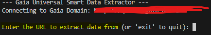
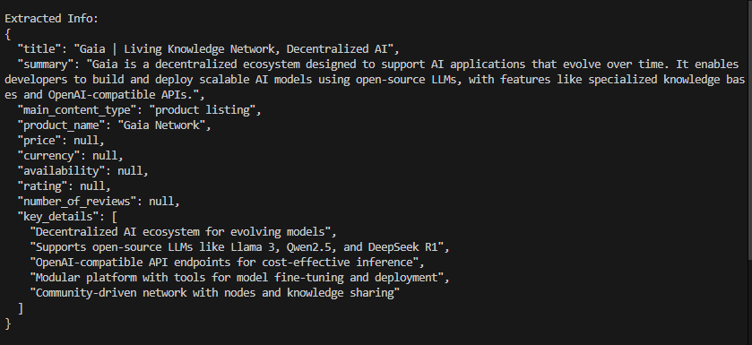
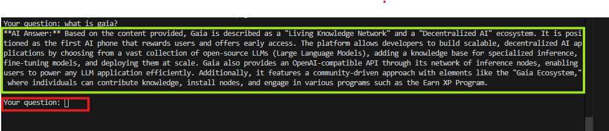

# 🚀 Gaia Universal Smart Data Extractor

A robust Python-based tool designed for comprehensive web content analysis, leveraging Selenium and a **Gaia AI Agent** for intelligent information extraction and interactive question-answering.

---


## ✨ Features

* **Universal Data Extraction:** Capable of fetching content from a wide array of public webpages and extracting key details such as title, summary, pricing, product names, and more into a structured JSON format.

* **Dynamic Content Support:** Utilizes **Selenium** to automate a headless web browser, enabling the rendering of JavaScript-heavy pages (e.g., e-commerce product listings) to ensure accurate and complete content capture.

* **AI-Powered Question-Answering:** Integrates with a **Gaia AI Agent** to provide an interactive Q&A experience. Users can pose arbitrary questions about the extracted webpage content, receiving concise and relevant answers.

* **Flexible and Extensible Architecture:** Designed for easy adaptation of extraction prompts and seamless integration with various AI models hosted on your Gaia Domain.

* ~Note:~ It sometimes can provide wrong answers and cannot extract data properly please restart the IDE in this case.

---


## 🛠️ Installation

To set up and run this project, ensure Python is installed on your system, then follow the steps below:
It is recommended to run this script using higher LLMs.

**Running Script for First time will take time.**

### 1. Clone the Repository

Begin by cloning the project repository to your local machine:

```bash
git clone https://github.com/MAYANK-MAHAUR/GAIA-AI-DATA-EXTRACTOR.git
cd GAIA-AI-DATA-EXTRACTOR
```

### 2. Set Up Python Environment

It is highly recommended to use a virtual environment to manage project dependencies:

```bash
python -m venv venv
# On Windows:
.\venv\Scripts\activate
# On macOS/Linux:
source venv/bin/activate
```

### 3. Install Python Dependencies

```bash
pip install -r requirements.txt
```
---

## 🔑 Configuration

To enable communication with your Gaia Domain AI Agent, configuration is required:

1.  **Create a `.env` file** in the root directory of your project (at the same level as `extractor.py`).

2.  **Populate the `.env` file** with your Gaia Domain URL and API Key:

    ```env
    GAIA_DOMAIN_URL=YOUR_DOMAIN_URL # Replace with your actual Gaia Domain URL 
    GAIA_API_KEY=YOUR_GAIA_API_KEY_HERE # Replace with your actual Gaia API Key
    MODEL=YOUR_MODEL_NAME_HERE # Replace with your actual model name
    ```
---


## 🚀 Usage

Once all installation and configuration steps are complete, execute the script from your terminal:

```bash
python extractor.py
```

The script will guide you through the following interactive process:

1.  **Enter a URL:** You will be prompted to provide the URL of the webpage from which you wish to extract data.

    

2. **Temporary Storage** It stores the extracted information temporarily.

    

2.  **View Extracted Information:** Upon successful processing, the script will display the initial structured JSON data extracted by the Gaia AI Agent.

    

3.  **Engage in Q&A:** Following the initial extraction, an interactive question-answering session will commence. You can type any question pertaining to the webpage's content, and the Gaia AI Agent will endeavor to provide a relevant answer based on the processed information.

    

    

4.  **Terminate Session:** Type `done` to conclude the Q&A session and proceed to enter a new URL, or type `exit` at the URL prompt to terminate the script.

---


## 💡 How It Works (Under the Hood)

This project integrates several powerful technologies to deliver its functionality:

* **`selenium`**: Orchestrates a real Chrome browser instance, operating in headless mode (without a visible graphical interface). It navigates to the specified URL, waits for all dynamic content (including JavaScript-rendered elements) to fully load, and then captures the complete HTML source of the rendered page.

* **`BeautifulSoup`**: Serves as the HTML parsing library. It processes the captured HTML, intelligently identifying and removing extraneous elements such as scripts, styles, headers, and footers, thereby yielding a clean, readable text representation of the webpage's core content.

* **Gaia AI Agent (`openai` client)**:
    * Receives the pre-processed, cleaned text content from the webpage.
    * Utilizes a carefully crafted `system` prompt to guide its initial operation, which involves extracting predefined structured information (e.g., title, summary, product details) into a JSON format.
    * For the interactive Q&A phase, it receives each user's question alongside the relevant portion of the webpage's text content. This contextual awareness enables the AI to provide accurate and on-demand answers to diverse inquiries.

---

## 🤝 Contributing

Contributions to this project are welcome! Feel free to fork this repository, open issues to report bugs or suggest enhancements, or submit pull requests with your improvements.

---
